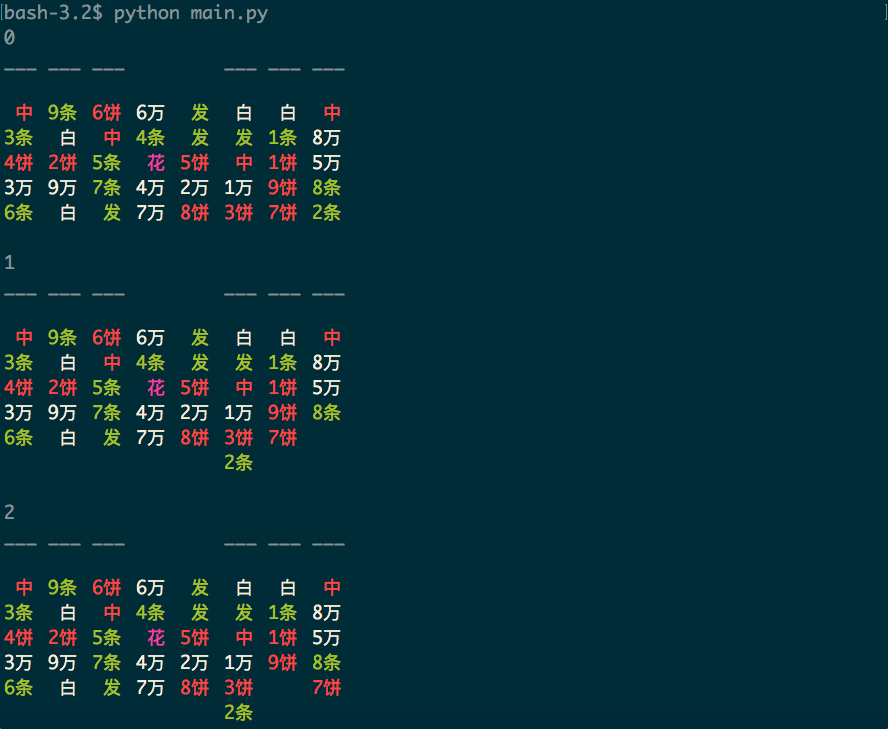

# SolitaireBot
A bot for the solitaire game in Zachtronics's SHENZHEN I/O that helps you get the "Become Immortal" achievement. Once you enter Solitaire, it will play the game automatically one game after another until the 100th game. 

## Getting Started
The bot requires ```Pillow```, ```numpy``` and ```PyAutoGUI``` in py2 and must be run under 1440 * 900 resolution. To install these dependencies, run

```
pip install -r requirements.txt
```

To run the bot, enter SHENZHEN I/O and Solitaire and run following command

```
python main.py
```

Now you can go hands-off and the bot will take it from there. 


The solution will also be shown on Terminal for your reference. 



To stop the bot, move the mouse to the upper-left corner of the screen and press ```Ctrl-C``` in the terminal. 

## How it works
The program implements a best first search algorithm that prioritizes moving cards in the tableau. It can solve 89% of random solitaire games in 1 second and gives up on the rest before timeout. At the start of each game, the program takes a screenshot and reads the board from the picture(which could take a while). It then solves the problem and controls the mouse to carry out its master plan to win the game. 
