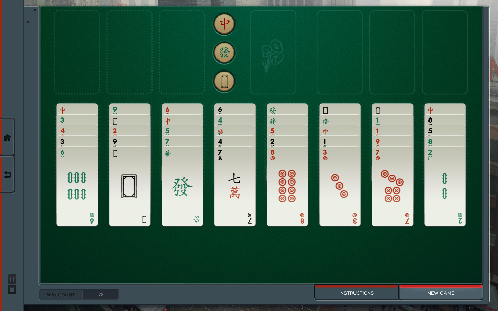

# SolitaireBot
Shenzhen I/O mahjong solitaire bot

First, get a 1440 * 900 screenshot of the game. 



Next, rename the screenshot picture to ```test.png```. Run command

```
$ python main.py test.png
```

You will get the solution to the solitaire problem within a split of a second. 


The program implements a best first search algorithm that can solve 85% of random solitaire games. 
